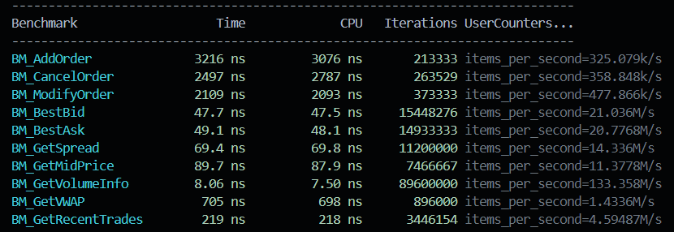

# Order Book Simulator

This is my implementation of a Limit Order Book (LOB) with a particular focus on performance. Features include:

- O(log n) operations for adding, cancelling and modifying orders
- O(1) operations for getting best bid/ask, spread, mid-price and volumes
- Support for multiple types including Market, Limit, Stop Loss, Fill-or-Kill and Immediate-or-Cancel
- Red-black trees for price-time priority matching using `std::multiset`


## Benchmarking

I used Google Benchmark to measure the performance of each operation individually. Most notably the core methods (add, cancel, modify) achieved an average latency of 2.607 μs and the `getVolumeInfo` function, which returns the aggregated quantity of bids and asks, achieved the best latency at 8.06ns and a throughput of 133.3M operations/second.




## Setup & Usage

### Prerequisites
- C++20 compatible compiler 
- CMake

```bash
# clone repository
git clone https://github.com/yourusername/Order-Book-Simulator.git
cd Order-Book-Simulator

# install google benchmark (first go to a directory outside the project)
cd ..
git clone https://github.com/google/benchmark.git google-benchmark
cd google-benchmark
cmake -G "MinGW Makefiles" -DCMAKE_BUILD_TYPE=Release -DBENCHMARK_ENABLE_TESTING=OFF .
cmake --build . --config Release

# build and run
cd ../Order-Book-Simulator
mingw32-make run-bench  # compiles, runs benchmarks, and saves results
```
